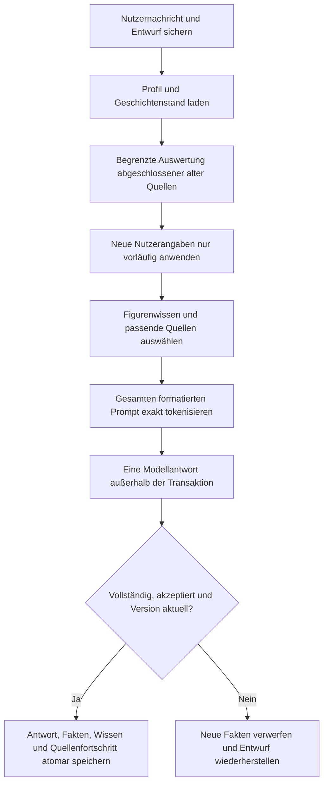

# Dauerhaftes Gedächtnis in Geschichten

Geschichten 0.8.0 ist ein lokaler Debug-Teststand mit Versionscode 14 und Datenbankversion 9. Aktuelle Zustände liegen dauerhaft in derselben SQLite-Datei wie die Gespräche. Besitzer, Standorte, Farben, Verletzungen, Ziele und bestimmte Beziehungsentwicklungen werden vor jeder Antwort unabhängig vom begrenzten Gesprächsausschnitt geladen. Eine neue Ansicht **Gedächtnis** ermöglicht Quellenprüfung, eigene Festlegungen, Korrekturen, Anheften und Ausschließen.

Die Speicherung, Kontextplanung und Modellantworten werden getrennt geprüft. Ein korrekt übergebener Fakt ist keine Garantie, dass ein kleines Modell ihn richtig verwendet. Automatische Erkennung und Antwortprüfung sind bewusst auf nachvollziehbare deutsche Ausdrucksformen begrenzt. Unklare Sprache bleibt im Archiv oder erscheint als unsicher. Es gibt kein Training, keine Adapterintegration und keine zusätzliche Online-KI. Dieser Stand wird nicht veröffentlicht.

## Ausgangsstand und erhaltene Funktionen

Grundlage ist der private Android-Quellstand 0.7.4 mit Kotlin, Compose und SQLite, einschließlich der Kontextreparaturen aus `docs/chat-kontext-pruefung.md`. Die Quellkopie vor diesem Auftrag liegt unter `docs/validation/dauerhaftes-gedaechtnis/source-before.zip`; ihr Dateiverzeichnis steht in `source-before.json`.

Alle 90 Figuren, Porträts und vollständigen Einführungen bleiben erhalten. Gespielte Nachrichten werden durch das Gedächtnis nicht umgeschrieben. Live-Figurenprofile gelten weiterhin in bestehenden Geschichten; der gespeicherte Einstieg und die historische Ausgangsszene bleiben unverändert. Für neue eigene Figuren wird auch deren Ausgangsszene beim Erstellen einer Geschichte eingefroren. Umbenennungen erhalten die ID der Figurenperson; alte Namen bleiben als Geschichtenalias verfügbar.

Die Reparaturen an Qwen-Chat-Templates, Rollenübersetzung, Streaming, Abbruch, Kontextcache und vollständigem Antwortende bleiben enthalten. Der frühere Zusammenfassungscode bleibt als Diagnosebestand vorhanden; der Produktionsablauf ruft ihn nicht mehr auf. Modell-Dateien, Revisionen, SHA-Prüfungen, Auswahl und Geräteleistungseinstellungen bleiben unverändert.

## Antwortablauf



Die Nutzernachricht wird zunächst im Archiv und als wiederherstellbarer Entwurf gesichert. Ihre Fakten sind für die anstehende Inferenz nur eine Vorschau im Arbeitsspeicher. Das Modell bekommt somit eine gerade genannte Farbkorrektur oder Übergabe, während die dauerhafte Datenbank noch den zuvor erfolgreich bestätigten Stand enthält.

Nach der vollständigen Antwort prüfen die bestehenden Antwortfilter und `MemoryReplyGuard` erkannte Faktenwidersprüche. Eine kurze SQLite-Transaktion prüft danach die Geschichtenrevision und die noch aktuelle Nutzernachricht. Sie fügt Antwort, akzeptierte Fakten, Wissen, Verarbeitungsfortschritt und eine eindeutige Sendequittung gemeinsam ein. Eine Wiederholung derselben Quittung schreibt nichts doppelt. Während der Inferenz bleibt keine Datenbanktransaktion offen.

Abbruch, Tokenlimit, Fehler und veraltete Revision speichern keine neuen bestätigten Ereignisse aus diesem Sendeversuch. Ein verspäteter Streaming-Callback kann nach Abbruch weder den nächsten Chat noch dessen Vorschau verändern. Frühere gültige Fakten und bereits gespeicherte abgeschlossene Antworten bleiben erhalten. Die wiederhergestellte Nachricht ermöglicht einen neuen Versuch.

## Datenmodell und Migration

Die bestehenden Tabellen `characters`, `stories`, `messages` und `memories` bleiben bestehen. SQLiteOpenHelper führt die Erweiterung 8 → 9 innerhalb seiner Migrationstransaktion aus. Die vorhandene Upgrade-Kette älterer Versionen bleibt erhalten.

| Neue Tabelle | Inhalt und Zweck |
| --- | --- |
| `story_memory` | Revision und abgeleiteter Handlungsüberblick je Geschichte |
| `memory_entities` | Stabile Geschichtenidentitäten für Personen, Gegenstände, Szene, Ziele, Beziehungen und Ereignisse |
| `state_facts` | Eigenschaft, Wert, Status, Pin, Quelle, Quellenwortlaut, Version, Zeit, Quellenreihenfolge und Kennzeichnung einer eigenen Festlegung |
| `fact_knowledge` | Welche Figur welchen Fakt kennt, mit Quelle und Erwerbsrevision |
| `memory_sources` | Welche vollständige Nachricht nach den Erkennungsregeln ausgewertet wurde; ihre vollständige Zeichenlänge als Fortschrittsnachweis |
| `memory_exclusions` | Ausschlussmarkierungen gegen erneute Anlage aus derselben Quelle |
| `memory_commits` | Eindeutige Sendequittung mit Nutzer- und Antwortnachricht |
| `memory_note_links` | Verbindung vorhandener manueller Notizen mit ihren strukturierten Fakten |
| `memory_character_aliases` | Frühere und aktuelle Namen derselben Geschichtenfigur |

Ein eindeutiger partieller Index erlaubt pro Geschichte, Entity und Eigenschaft nur einen aktuellen Fakt. Frühere Fassungen werden historisch. Verletzungen besitzen eigene Eigenschaften je Körperstelle; mehrere Verletzungen überschreiben einander nicht. Ein Gegenstand nutzt dieselbe Eigenschaft für Besitzer oder Ablageort, sodass er nach dem Ablegen nicht zusätzlich als getragen gilt. Unterschiedliche Versprechen bleiben getrennt erhalten. Eine begründete Änderung von Vertrauen zu Misstrauen ersetzt den bisherigen Vertrauensstand.

Zeit und Quellenreihenfolge verhindern, dass später nachgelesene alte Nachrichten den neueren Stand ersetzen. Gleichzeitige Nachrichten mit derselben Millisekunde werden anhand ihrer Archiv-Reihenfolge unterschieden. Eigene Korrekturen sind ausdrücklich gekennzeichnet. Ein späteres unabhängiges Ereignis darf sie weiterentwickeln; alte Quellen dürfen sie nicht rückwirkend verdrängen.

Die Migration erhält IDs, Texte, Reihenfolge, Zuordnungen, Profile, Zusammenfassungen und manuelle Notizen. Entwürfe und Modellwahl bleiben in ihren bisherigen Preferences. Unveränderte Startvorgaben werden unsicher übernommen. Ungeprüfte automatische Zusammenfassungen werden keine aktuellen Weltfakten. Eine ausdrücklich angeheftete alte Notiz bleibt eine eigene Notiz, ohne dass ihr Inhalt als automatisch geprüfte Ereignisse ausgegeben wird.

Alte Gespräche werden beim Öffnen und vor dem Senden begrenzt nachgelesen: regulär höchstens vier ältere und zwei jüngste noch unbearbeitete abgeschlossene Quellen. Der Knopf für weitere Auswertung bearbeitet höchstens acht ältere plus zwei jüngste Quellen. Doppelte Quellen werden entfernt. Eine ausstehende letzte Nutzernachricht wird dabei nicht dauerhaft bestätigt. Der App-Start spielt nicht sämtliche Geschichten erneut ab. Die Ansicht zeigt noch ausstehende Quellen an.

## Quellenprüfung und Erkennungsgrenzen

Es wird kein vom Modell erzeugtes JSON als Wahrheit übernommen. Der gemeinsame Parser liest den vollständigen deutschen Quellenwortlaut und erzeugt nur Vorschläge nach festgelegten Regeln. Datenbankprüfung kontrolliert Quelle, Geschichte, tatsächliches Zitat, Ausschlussmarkierungen, Reihenfolge und bestehende aktuelle Werte. Fragen, Vermutungen und rückwirkende Erinnerungsbehauptungen überschreiben bestätigte Fakten nicht.

Die Regeln unterstützen benannte Gegenstände wie Schlüssel, Schwert, Ring, Brief, Gerät, Karte, Buch und weitere festgelegte Arten; bestimmte Farben; expliziten Besitz, Übergabe, Ablage, Verstecken und Aufnehmen; einfache Ortsangaben; benannte Körperstellen und Verletzungszustände; Zielstatus; ausdrückliche Entscheidungen und Zusagen sowie begründetes Vertrauen oder Misstrauen. Beispiele sind „Ich lege den Schlüssel in die Truhe“, „Der Schlüssel ist jetzt blau“, „Meine linke Hand ist verletzt“ und „Ziel Flucht ist abgeschlossen“.

Ein gültiges Zitat allein wird nicht als universelle semantische Prüfung dargestellt. Freie Metaphern, komplexe indirekte Rede, mehrere gleichartige Gegenstände ohne klare Identität, unbekannte Gegenstandsarten, komplizierte Zeitfolgen und viele neue Handlungen benötigen gegebenenfalls eine eigene Festlegung in der Oberfläche. Unerkannte Sprache bleibt im vollständigen Archiv. Der Fortschrittsmarker bedeutet vollständig mit diesen Regeln gelesen; er bedeutet nicht, dass jeder mögliche Sachverhalt sprachlich verstanden wurde. Diese Grenze gilt für alle sechs Modelle.

Eine eindeutig neue Figurenhandlung darf persistieren, etwa das Ablegen eines zuvor eigenen Gegenstands, das Aufnehmen eines bekannten abgelegten Gegenstands, eine Bewegung der Figur oder eine ausdrückliche neue Zusage. Bloße Modellbehauptungen über bestehenden Besitz, Farben oder angebliche Vergangenheit bleiben unsicher. Die Antwortprüfung kann erkannte Widersprüche zurückweisen, umfasst aber keine vollständige Prüfung beliebiger Prosa. Es gibt keine endlosen Reparaturschleifen und keine versteckte Folgeinferenz. Ein abgelehnter Versuch erhält den Entwurf.

## Weltzustand und Figurenwissen

Weltfakten und Wissen werden separat gespeichert. Versteckt die Nutzerperson den Schlüssel heimlich, wird der Standort nach erfolgreicher Antwort gespeichert. Die Figur bekommt ihn nicht als Wissen. Für die Inferenz wird die unbeobachtete Nutzernachricht durch einen neutralen Hinweis ersetzt, ohne Schlüsselort oder weitere geheime Details. Die Figur erhält ihren zuletzt beobachteten Stand und den Hinweis, dass der aktuelle Stand unbekannt sein kann.

Eine ausdrückliche Mitteilung wie „Ich sage Mira, der Schlüssel liegt in der Truhe“ ergänzt den Wissenserwerb samt Mitteilungsquelle. Sie legt keinen zweiten Schlüssel an. Auch der abgeleitete Überblick enthält nur der Figur bekannte Angaben. Bei eigenen Festlegungen und Korrekturen ist das Wissen als Checkbox einstellbar; eine private Korrektur verrät sich nicht automatisch.

Die automatische Geheimniserkennung ist konservativ und erkennt bestimmte Formulierungen wie „heimlich“, „unbeobachtet“ oder „ohne … bemerkt“. Enthält eine Nutzernachricht solche Angaben, wird derzeit die gesamte Nachricht für die Figur verdeckt. Öffentliche Rede und geheime Handlungen deshalb gegebenenfalls in getrennten Nachrichten schreiben. Implizite Geheimnisse und das Wissen beliebiger Nebenfiguren werden nicht allgemein erschlossen. Der aktuelle Produktions-Erzähler hat dieselbe Wissensgrenze wie die Hauptfigur.

## Abruf und genaues Tokenbudget

Aktuelles Profil, bekannte strukturierte Zustände, angeheftete Notizen und die neueste Nachricht sind verbindlich. Personen und Besitzer werden mit Namen bezeichnet, um Rollenwechsel durch mehrdeutiges „du“ und „ich“ zu vermeiden. Der gültige Stand erscheint zusätzlich unmittelbar vor der neuesten Eingabe. Historische Startabsätze und der ursprüngliche Auftakt werden nicht wieder eingefügt, wenn die Regeln dort einen Widerspruch zum gültigen bekannten Zustand erkennen.

Der übrige Verlauf wird in vollständigen jüngsten Gesprächsrunden ausgewählt. Exakt identische ältere Runden werden im Prompt nur einmal repräsentiert; jede Originalnachricht bleibt im Archiv und in der Quellenauswertung erhalten. Nicht angeheftete Erlebnisnotizen werden nach Wortüberschneidung mit der neuen Frage und danach nach Aktualität geordnet. Das ist eine einfache lokale Suche, keine semantische Vektorsuche. Aktuelle Zustände hängen von dieser Suche nicht ab. Ausgeschlossene Quellen werden aus dem Prompt weggelassen, während ihr Archivtext erhalten bleibt.

Jede Auswahl zählt den vollständigen tatsächlich formatierten Prompt mit der Laufzeitvorlage und dem genauen Tokenizer. Alle sechs Modelle besitzen 4096 Kontexttoken; 512 sind für die Antwort reserviert. GGUF verwendet dieselbe native Template- und Tokenisierungsfunktion zum Planen und Generieren. LiteRT rendert die tatsächlich erzeugte Vorlage vorab; Gemma nutzt sein originales SentencePiece-Modell, Qwen seinen festen Wortschatz und Merge-Regeln einschließlich NFC-Normalisierung. Modellabhängig automatisch ergänzte Starttoken werden mitgezählt.

Die eingebetteten Tokenizerdaten stammen aus den unveränderten katalogisierten LiteRT-Dateien. Die drei Assets enthalten rund 16,5 MB unkomprimierte Tokenizerdaten, keine Gewichte. Das Extraktionsskript, Abschnittsprüfsummen und 177 vollständige Vergleiche der Token-ID-Folgen liegen im Validierungsordner. Rollenmarker, deutsche Sonderzeichen, kombinierende Zeichen, Emoji und die tatsächlich gerenderten Diagnoseprompts sind enthalten. Alle 177 Vergleiche stimmen mit den ursprünglichen eingebetteten Tokenizern überein.

Überfüllte Pflichtinhalte werden ausdrücklich gemeldet; der Entwurf bleibt erhalten und Fakten werden nicht still gekürzt. Optionaler Verlauf kann entfallen. Vom langen originalen Auftakt darf ein vollständiger Absatz-Auszug für die Inferenz ausgewählt werden; Archiv und Gedächtnisauswertung verwenden weiterhin die komplette Quelle. Die alten Zusammenfassungen werden nicht in diesen Nebenkanal eingespeist.

## Handlungsüberblick und Aufwand

Der neue Handlungsüberblick wird aus bekannten, bestätigten Beziehungs- und Erlebnisfakten abgeleitet. Aktuelle Gegenstands-, Orts-, Verletzungs- und Zielzustände werden separat geladen. Eine angeheftete Notiz stoppt keine weitere Auswertung. Es gibt keinen zusätzlichen Modellaufruf für Extraktion oder Zusammenfassung, somit auch keine wiederkehrende Blockade durch einen defekten Zusammenfassungsaufruf. Die begrenzte Rückfallstrategie ist eine regelbasierte Übersicht und bei unklarem Inhalt Archiv plus eigene Festlegung.

Der Umfang dieser Übersicht ist kleiner als eine literarische Nacherzählung beliebiger älterer Prosa. Daraus wird kein vollständiges episodisches Verständnis sämtlicher Dialoge abgeleitet. Die ursprünglichen Nachrichten bleiben immer nachprüfbar.

## Bedienung

Der Reiter **Gedächtnis** und das Gedächtnissymbol im Chat öffnen den Stand der ausgewählten Geschichte. Gruppen unterscheiden Gegenstände, Personen und Szene, Ziele, Beziehungen sowie Erlebnisse. Karten zeigen aktuell, historisch, unsicher oder ausgeschlossen, Anheften, Figurenwissen und Quelle. Interne IDs und Tokenprüfwerte werden nicht angezeigt.

Die Bearbeitung zeigt den Quellenwortlaut und, soweit vorhanden, die vollständige ursprüngliche Nachricht. Eine Korrektur wirkt vor der nächsten Antwort. Historie und Original bleiben erhalten. Anheften verpflichtet den Abruf, erlaubt aber spätere berechtigte Entwicklungen. Ausschließen markiert sämtliche früheren Fassungen der Eigenschaft gegen Wiederanlage aus denselben Quellen. Eine spätere neue Quelle darf einen neuen Zustand schaffen. Die Oberfläche unterscheidet dies vom Löschen des Gesprächsverlaufs.

**Zustand festhalten** ergänzt fehlende Informationen. Ziele verwenden die Auswahl Offen oder Abgeschlossen. Verletzungen verwenden „Körperstelle: Zustand“, damit verschiedene Körperstellen getrennt bleiben. Der Editor bleibt bei Speicherfehlern offen. Sein scrollbarer Inhalt besitzt eine feste verfügbare Höhe, während Speichern und Schließen erreichbar bleiben. Der bestehende Notizeditor und der vollständige Textexport bleiben nutzbar; der Export enthält zusätzlich strukturierte Fakten, Status und Herkunft.

## Abnahme und Nachweise

| Prüfung | Ergebnis und Beleg |
| --- | --- |
| Abschließende reguläre Logiktests | 103 bestanden, kein Fehler und keine Auslassung; `unit-final.log`, `unit-test-xml/` |
| Erweitertes Android-/Compose-Profil | 183 Fälle: 181 bestanden, zwei betriebssystembedingt ausgelassen, kein Fehler; `all-visual-verified.log`, `full-test-xml/` |
| Gezielte Abschlussprüfung von Datenbank, Gedächtnisansicht und ViewModel | 60 bestanden, kein Fehler; `memory-final-tests.log`, `memory-test-xml/` |
| Vollständige Token-ID-Vergleiche | 177 von 177 identisch; `tokenizer-results.json` und `tokenizer-final.log` |
| Inferenz mit endgültigem Planner | 36 von 36 geplanten Promptzählungen identisch mit tatsächlicher Laufzeit; maximal 1127 Eingabetoken plus 512 Reserve |
| APK und Lint | Build erfolgreich, null Lint-Fehler, 125 Warnungen; `build-verified.log`, `lint-final.xml` |

Die Testläufe überschneiden sich und werden nicht addiert. Das erweiterte Profil enthält die Figuren-, Migrations-, UI- und Kontextprüfungen. Die letzten zusätzlichen Parser- und Duplikatregeln sind im abschließenden regulären Lauf enthalten; die vollständige erweiterte Suite wurde nach diesen letzten reinen Logikergänzungen nicht erneut ausgeführt. Die gezielten Datenbank- und UI-Prüfungen liefen nach den Schema- und Editoranpassungen.

Die beiden ausgelassenen Fälle prüfen die Android-FileProvider-Pfadvalidierung. Robolectric verwendet auf Windows Backslashes, während AndroidX beim Wurzelvergleich `/` erwartet. Das Verhalten wurde im festgelegten Core-1.16-Bytecode und im [offiziellen FileProvider-Quelltext](https://raw.githubusercontent.com/androidx/androidx/androidx-main/core/core/src/main/java/androidx/core/content/FileProvider.java) überprüft. Die ausgelassenen Fälle bleiben für Android beziehungsweise Linux offen; Produktionsprovider und Berechtigungen wurden nicht geändert. Ein zusätzlicher Test prüft die tatsächlich konfigurierte Provider-Metadatei. Dies ist kein Fehlernachweis für Android.

Ein lokaler SQLite-Langlauf mit 100 synthetischen Runden erhielt 203 Archivnachrichten, 210 Faktenversionen und acht aktuelle Fakten. Gemessen wurden 18 ms Median, 22 ms am 95. Perzentil, maximal 62 ms und 880640 Bytes Datenbankgröße. Das sind Desktop-Robolectric-Werte ohne Inferenz. Es gibt keinen zusätzlichen Gedächtnis-Modellaufruf. Die genaue Promptplanung benötigte nach ihrer ersten Initialisierung je Modell 7–26 ms; die erste Planung 117–189 ms. Smartphone-RAM und Smartphone-Wartezeit werden daraus nicht abgeleitet.

| Fall | Beobachtetes deterministisches Ergebnis |
| --- | --- |
| Eine Figur, zwei Geschichten | Getrennte Besitzer-, Farb- und Szenenstände; keine Übertragung |
| Übergabe und Ablage | Dieselbe Gegenstands-ID; Besitzerwechsel, danach Truhe als Standort |
| Farbkorrektur | Eine aktuelle Farbe; vorherige Fassungen historisch |
| Ortswechsel und Verletzungen | Neuer Ort; mehrere Körperstellen bleiben unverändert |
| Abgeschlossenes Ziel | Alte Startangabe öffnet es nicht; ausdrückliche Wiederaufnahme möglich |
| Geheimnis und spätere Mitteilung | Weltstand geändert; Wissen erst mit Quelle der Mitteilung |
| Unbekannte Vergangenheit | Fragen und Vermutungen erzeugen keine bestätigten Weltfakten |
| Manuelle Korrektur und Anheften | Neuer Stand im nächsten Prompt; andere Zustände entwickeln sich weiter |
| Ausschluss und Wiederholung | Kein Wiederauferstehen aus denselben Quellen; neue Quelle erlaubt |
| Alte Zusammenfassungen | Überschreiben keine neueren Fakten und blockieren keine Antwort |
| Lange Quelle und Nachlesen | Mitte vollständig ausgewertet; voller Fortschritt; jüngere Quelle behält Vorrang, auch bei identischem Zeitstempel |
| Abbruch, doppelt senden, späte Ausgabe | Keine Teilereignisse; Entwurf wiederhergestellt; Ausgabe eines alten Laufs verworfen |
| Neustart und Profiländerung | Zustand und eingefrorener Einstieg erhalten; Live-Profil wirksam; Personen-ID bei Umbenennung stabil |
| Migration | Vorhandene Nachrichten, Profile, manuelle Notizen, Zuordnungen und Entwurf erhalten |
| Kontext überfüllt | Echter Zähler bindend; Pflichtstand bleibt oder ausdrücklicher Fehler |
| Oberfläche | Karten, Quelleneditor, Korrektur, Historie und eigene Festlegung bedienbar |

Die Datenbanktests verwenden echtes Android-SQLite unter Robolectric. ViewModel-Abbruchtests verwenden ausdrücklich Test-Doubles; deren Antworten sind keine Qualitätsnachweise. Die Oberflächenbilder stammen aus der tatsächlichen Compose-Oberfläche auf synthetischem Telefonformat 393 × 852 dp. Sie sind keine Aufnahmen eines physischen S24.

[Aktueller Stand](validation/dauerhaftes-gedaechtnis/screenshots/01-zustand.png), [Quellen und Korrektur](validation/dauerhaftes-gedaechtnis/screenshots/02-korrektur.png), [Historische Fassungen](validation/dauerhaftes-gedaechtnis/screenshots/03-historie.png) und [Editor bei absichtlich simuliertem Speicherfehler](validation/dauerhaftes-gedaechtnis/screenshots/04-neuer-zustand.png) zeigen die erreichbare Oberfläche. Der letzte Screenshot enthält den synthetischen Testfehler; er gehört nicht zum Produktionsablauf.

## Echte Modellantworten

Alle sechs vorhandenen Katalogmodelle wurden lokal mit unveränderten Gewichten und denselben Einstellungen geprüft: CPU, vier Threads, 4096 Kontexttoken, 512 Ausgabetoken, Temperatur 0,75, Top-p 0,9, Top-k 40 und Wiederholungsstrafe 1,08 mit Fenster 256. Für den Vergleich stehen 36 echte Antworten des bisherigen Ablaufs und 36 des endgültigen Gedächtnisablaufs gegenüber. Weitere 36 Zwischenantworten während der Entwicklung bleiben als gesonderte Rohbelege erhalten und sind keine Endergebnisse.

Fünf synthetische Situationen wurden geprüft: kurzer Ausgangszustand, Übergabe/Ablage/Farbkorrektur, langer Verlauf, unbekannte Vergangenheit und heimliches Verstecken. Der lange Verlauf enthält 50 Nachrichten mit vielen exakt wiederholten Mauerbeschreibungen. Er wurde zusätzlich mit Diagnose-Seed 31415 statt 42 wiederholt. Das zeigt den Abruf alter Fakten nach wiederholtem Fülltext; es ersetzt keinen vielfältigen Langdialog oder eine Prüfung aller 90 Figuren. Die festen Seeds sind nur im Desktop-Prüfprogramm gesetzt, der native Diagnoseexport ist in der APK nicht enthalten.

Die folgende Bewertung liest die gesamte Antwort einschließlich Erzählertext. „Zurückgewiesen“ bedeutet, dass die App einen erkannten Widerspruch nicht dauerhaft übernimmt. Es bedeutet nicht, dass das Modell korrekt geantwortet hat. Umgekehrt beweist „akzeptiert“ keine fehlerfreie Antwort.

| Modell | Kurz | Ablage und Farbe | Lang, Seed 42 | Lang, Wiederholung | Unbekannte Vergangenheit | Geheimnis |
| --- | --- | --- | --- | --- | --- | --- |
| Gemma 4 E2B | Verletzung zusätzlich bei Mira | Korrekt | Alle abgefragten Fakten korrekt | Zweiten alten Schlüssel erfunden; zurückgewiesen | Unbekannt richtig benannt; Sprachfehler | Erzählung gibt Mira den Schlüssel |
| Huihui Qwen 3 4B | Korrekt | Korrekt | Fakten korrekt; Wortfehler | Kernfakten korrekt, Übergabebeteiligte falsch | Keine Farbe erfunden, Schwester der falschen Person | Korrekt unsicher, kein geheimer Ort behauptet |
| Dolphin Llama 3.2 3B | Unvollständig | Besitzer falsch | Rolle und Besitzer falsch; zurückgewiesen | Besitzer und Verletzung falsch; zurückgewiesen | Farbe und Rolle erfunden | Geheimen Ort als Tatsache behauptet |
| Gemma 3 4B DBL-X | Teilweise, starke Sprachfehler | Besitzer falsch | Besitzer und Körperseite nicht eindeutig | Besitzer falsch; zurückgewiesen | Rote Rosen und Gespräch erfunden | Lastbekannten Besitz fälschlich sicher dargestellt |
| Qwen 2.5 1.5B | Spielerrolle übernommen; zurückgewiesen | Alte Handlung wiederholt, unsinnige Verletzungshandlung | Übergabe wiederholt; Frage unvollständig | Besitzer, Verletzungsrolle und Ziel falsch; zurückgewiesen | Keine Farbe erfunden, Schwester der falschen Person | Unbegründetes Hochheben, Frage unbeantwortet |
| Qwen 3 0.6B | Verletzungsrolle falsch; zurückgewiesen | Besitz falsch, grammatisch fehlerhaft | Wiederholt Fülltext | Wiederholt Fülltext | Wiederholt Fülltext | Frage unbeantwortet |

**Gemma 4, langer Verlauf, Seed 42:** Vorher hieß es „Ich habe den bronzenen Schlüssel.“ Der Erzähler gab Mira ebenfalls eine verletzte Hand, obwohl Rian den inzwischen silbernen Schlüssel trug und seine eigene linke Hand verletzt war. Nachher lautete die echte Antwort:

> *Mira schaut Rian an, ihre Mimik ist eine Mischung aus Vorsicht und leiser Sorge.* „Wir sind im Hof. Du hast den silbrigen Schlüssel. Deine linke Hand ist verletzt. Das Ziel Flucht ist abgeschlossen.“

Dieselbe Situation mit Seed 31415 erzeugte allerdings wieder „Ich habe den bronzenen Schlüssel. Du hast den silbrigen Schlüssel.“ Der gemeinsame Widerspruchsfilter wies diese Antwort zurück. In anderen Gemma-Antworten blieb eine falsch zugeordnete Verletzung im Erzählertext unerkannt. Der Stand im Prompt ist korrekt; die Modellverwendung und die begrenzte sprachliche Antwortprüfung bleiben fehleranfällig.

**Huihui, langer Verlauf, Seed 42:** Vorher wurden bronzener Besitz bei Mira und die Flucht als weiter offenes Ziel beschrieben. Nachher:

> *Mira blickt Rian an und sagt:* „Wir sind im Hof. Du hast den silbernenden Schlüssel, den du aus dem Turmzimmer mitgenommen hast. Deine linke Hand ist weiterhin verletzt. Das Ziel Flucht ist abgeschlossen.“

Die aktuelle Sache, ihr Besitzer, Verletzung, Ort und Ziel stimmen; „silbernenden“ ist fehlerhaftes Deutsch. Bei der Wiederholung stimmen die aktuellen Kernfakten ebenfalls, die Antwort schreibt die Übergabe aber den falschen Beteiligten zu. Auf die unbekannte Vergangenheit erfindet Huihui keine Farbe mehr, vertauscht jedoch Rians und Miras Schwester.

**Wissensgrenze:** Der endgültige Geheimnis-Prompt enthält den neuen heimlichen Ablageort nicht. Er nennt nur den zuletzt beobachteten Besitz bei Rian mit dem ausdrücklichen Hinweis, dass der aktuelle Stand unbekannt ist. Huihui fragt korrekt: „Ich weiß nicht genau, wo der Schlüssel gerade ist. Er ist bei dir, oder?“ Dolphin behauptet trotzdem die Truhe als aktuelle Tatsache. Im früheren öffentlichen Verlauf gab es bereits eine Ablage in einer Truhe. Der Befund belegt eine unzulässige Modellannahme; er belegt kein Übertragen des neuen Geheimtextes durch die Datenbank.

Alle Vorher-/Nachher-Antworten, tatsächlichen Prompts, manuellen Einzelbewertungen und Ablehnungen stehen in `model-assessment.json` und den referenzierten Rohdateien. `model-metrics.json` trennt Zähler und Zeiten von der inhaltlichen Bewertung. Im endgültigen Lauf stimmen alle 36 geplanten Tokenzahlen mit der Laufzeit überein; das größte Budget beträgt 1127 + 512 = 1639 Token. Exakt gleiche ältere Runden wurden im Prompt zusammengefasst, im Archiv erhalten. Unterschiedliche lange Runden werden weiterhin anhand des genauen Budgets ausgewählt.

| Modell | Planung nach Initialisierung | Erste Textausgabe auf diesem Desktop |
| --- | ---: | ---: |
| Gemma 4 E2B | 12–21 ms | 0,59–0,81 s |
| Huihui Qwen 3 4B | 7–13 ms | 8,22–12,82 s |
| Dolphin Llama 3.2 3B | 7–11 ms | 5,72–8,20 s |
| Gemma 3 4B DBL-X | 13–26 ms | 7,70–10,84 s |
| Qwen 2.5 1.5B | 10–17 ms | 1,27–1,75 s |
| Qwen 3 0.6B | 12–17 ms | 2,06–3,08 s |

Diese Werte betreffen CPU-Inferenz des Desktop-Prüfprogramms, enthalten die Modellinitialisierung nicht und stammen aus wenigen Fällen. Sie liefern weder eine S24-Geschwindigkeitsrangliste noch einen kontrollierten Vorher-/Nachher-Leistungsbenchmark. Im Gegensatz zu den Antwortbeispielen sind die Zeitwerte nur ein Aufwandshinweis für diese Umgebung.

## Geänderte Dateien

| Bereich | Dateien und Aufgabe |
| --- | --- |
| Datenstrukturen und Regeln | `memory/StoryMemory.kt`: Entity, Fakten, Wissen, Vorschau und begrenzte Quelle-zu-Fakt-Regeln |
| Datenbank | `memory/MemoryDatabase.kt`: Schema, Übernahme alter Notizen, Chronologie, Wissen, Ausschlüsse, Fortschritt und Übersicht |
| Kontext und Antwortprüfung | `memory/MemoryPrompt.kt`, `memory/MemoryReplyGuard.kt`: Abruf, Budget und erkannte Widersprüche |
| Repository | `data/StoryRepository.kt`, `data/Models.kt`: Migration 9, Stories, atomare Quittung, Korrektur und Nachlesen |
| Antwortsteuerung | `AppViewModel.kt`, `ai/StoryGeneration.kt`: Vorschau, Zähler, sichere Generierung und erweiterter Export |
| Native und LiteRT-Tokenisierung | `ai/ExactTokenizer.kt`, `ai/LocalModelEngine.kt`, `ai/GgufEngine.kt`, `cpp/gguf-jni.cpp`, `cpp/tokenizer-jni.cpp` |
| Oberfläche | `ui/UiState.kt`, `ui/MemoriesScreen.kt`, `ui/StateMemoryUi.kt`, `ui/StoryApp.kt`: Gedächtnis, Quellen und Bearbeitung |
| Build und Lizenz | `app/build.gradle.kts`, `cpp/CMakeLists.txt`, drei Tokenizer-Assets, SentencePiece-Quellen und Lizenz, `THIRD_PARTY_NOTICES.md`, Build-Helfer |
| Prüfungen | `MemoryRulesTest.kt`, `MemoryRepositoryIntegrationTest.kt`, `MemoryUiTest.kt`, aktualisierte Kontext- und Migrationstests; nachvollziehbare Tests für den umbenannten Reiter und den Windows-Provider-Test |
| Dokumentation | README, BUILD, dieser Bericht, kurzer Prüfbericht und reproduzierbare Diagnoseartefakte |

Die Dateien im Tabelleninhalt liegen unter `app/src/main/java/dev/vincent/geschichten`, `app/src/main` beziehungsweise den bisherigen Testquellverzeichnissen. Eine vollständige Liste mit Änderungen und Prüfsummen steht in `docs/validation/dauerhaftes-gedaechtnis/source-changes.json`.

## Lieferung und offene Geräteprüfung

Die kompatibel signierte lokale Testdatei liegt unter `F:\Geschichte App KI\geschichten-android\Geschichten-0.8.0.apk`. Als Update installieren, ohne die bisherige App zu deinstallieren. Paket-ID und Signierer entsprechen dem Ausgangsstand; die Installation auf einem vorhandenen Gerät ist noch nicht ausgeführt.

| Eigenschaft | Geprüfter Wert |
| --- | --- |
| Paket | `dev.vincent.geschichten` |
| Version | 0.8.0, Versionscode 14, Datenbank 9 |
| Android und Architektur | Android 12/API 31 oder neuer, Ziel API 35, ARM64 |
| Bytegröße | 321373977 |
| APK SHA-256 | `0b16aaf8831b24a1935351c78067af2f51ddb6b206f3cc29d09b980eff3f4a17` |
| Signierzertifikat SHA-256 | `3db10e5029fc46a9bbe9bbe6a93ede3acc3b60984f97c73ff0eeb4c50f12cb40` |
| Signaturprüfung | APK Signature Scheme v2 gültig; gleicher bestehender Testschlüssel |
| Native Bibliotheken | Alle ELF-LOAD-Segmente mindestens 16 KiB ausgerichtet; APK-Zipalign-Prüfung erfolgreich |
| Paketinhalt | Exakte Tokenizer und GGUF-Zähler enthalten; Diagnoseklassen und Seed-Export fehlen; drei Tokenizer-Assets ohne zusätzliche Gewichte |
| Veröffentlichung | Keine; der GitHub-Updater zeigt diesen lokalen Stand nicht an |

`apk-verification.json`, `apk-signature.txt`, `apk-badging.txt`, `apk-alignment.txt` und `apk-native/` enthalten die Prüfbelege. Die Qwen-Tokenizer-GGUFs besitzen null Gewichtstensoren. Ein kompletter Modelldownload ist weiterhin eine separate Nutzerwahl. Keine privaten Gespräche, Signierdateien oder vorhandenen Modellgewichte wurden veröffentlicht.

Ein physisches S24 beziehungsweise S24 Ultra ist für diese Sitzung nicht über ADB erreichbar. Lange echte Gespräche, Hintergrund/Vordergrund, Android-Prozessneustart, Abbruch, Figurenwechsel, Speicherdruck, Spitzen-RAM und Wartezeit auf diesen Geräten bleiben offen. Desktop-Inferenz und Robolectric ersetzen diese Prüfung nicht. Die vorhandenen Geschwindigkeitseinstellungen pro Gerät und Modell bleiben nutzbar.

Die automatische Faktenextraktion deckt begrenzte Ausdrucksformen ab. Die Antwortprüfung deckt erkannte Widersprüche ab. Kleine Modelle können weiterhin Rollen, Sprache, Zusammenhang, unbekannte Vergangenheit und unerkannte Tatsachen falsch darstellen. Der Prüfbericht weist solche Ergebnisse einzeln aus; aus Datenbank- und Tokenizertests wird keine allgemeine Zuverlässigkeitsquote für Geschichten abgeleitet.

## Reproduktion

```powershell
. '..\Build-Umgebung.ps1'
.\gradlew.bat :app:testDebugUnitTest -PvisualTests=true --no-daemon --max-workers=2 '-Pkotlin.compiler.execution.strategy=in-process'
.\gradlew.bat clean :app:assembleDebug :app:testDebugUnitTest :app:lintDebug --no-daemon --max-workers=2 '-Pkotlin.compiler.execution.strategy=in-process'
```

Der Produktionsbuild erfolgt ohne `visualTests`. Die privaten fertigen Modelle liegen ausschließlich im bisherigen Diagnoseordner, außerhalb der App-Assets. Das Skript `run-memory-models.ps1` verwendet feste synthetische Eingaben, CPU mit vier Threads und einen unabhängigen Snapshot der Produktionsklassen. Keine echten Nutzergespräche werden an einen Anbieter geschickt. Rohantworten, genaue Prompts, Tokenzähler, Grenzen, Zeiten und Ablehnungen werden lokal protokolliert.
